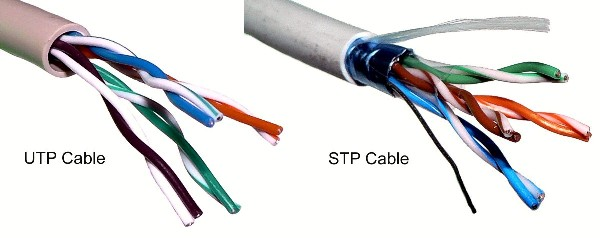
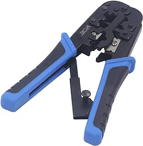
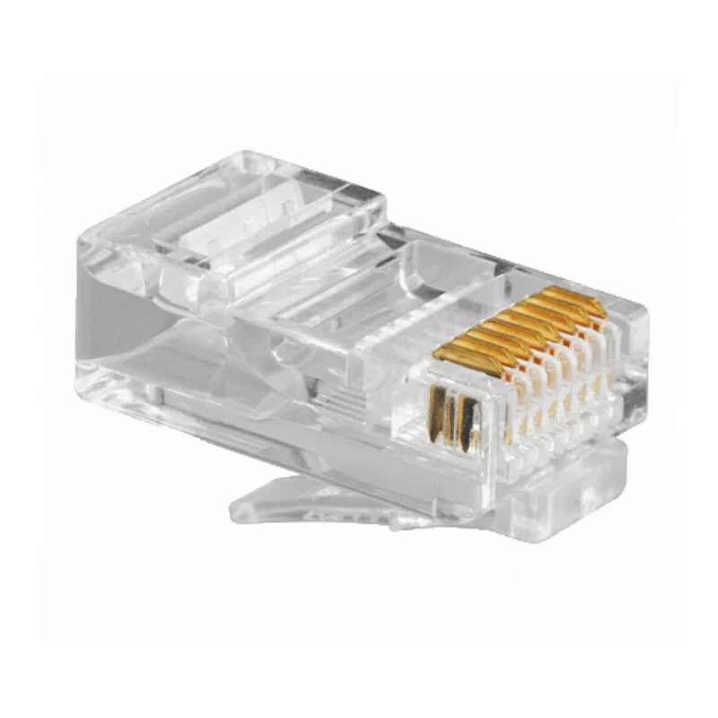
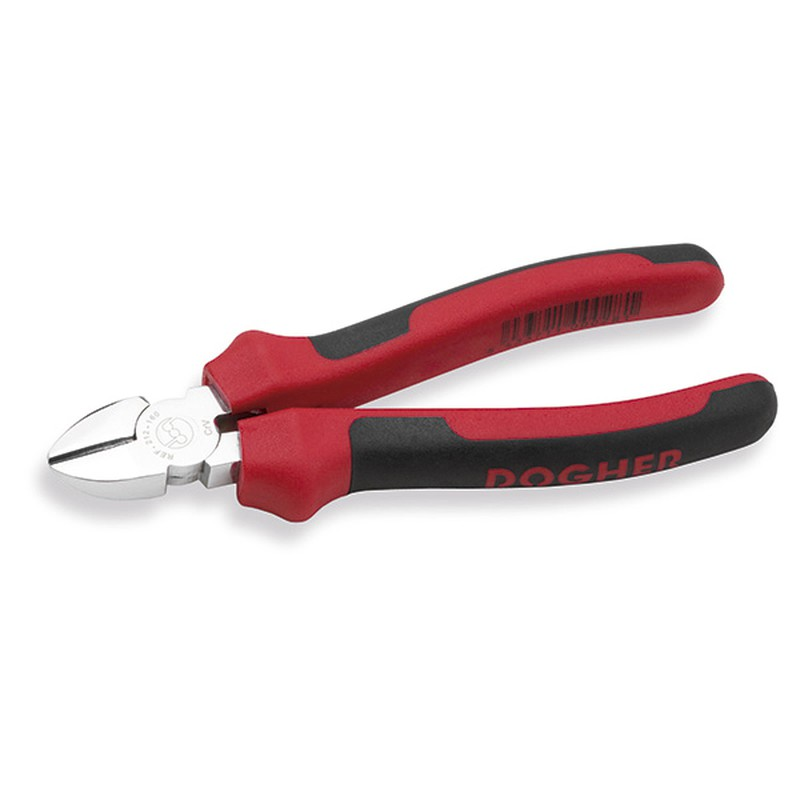
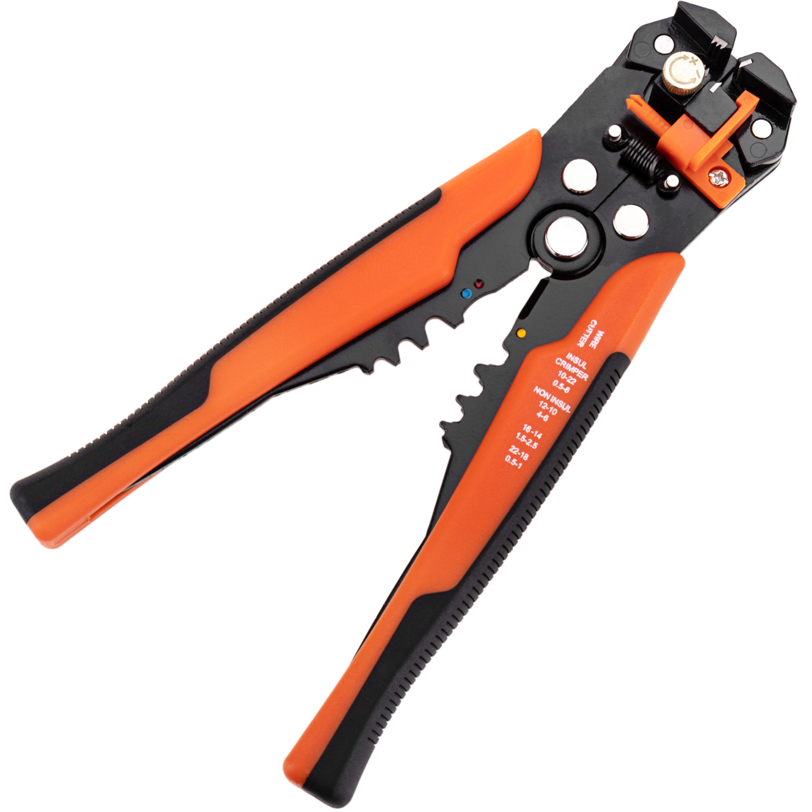
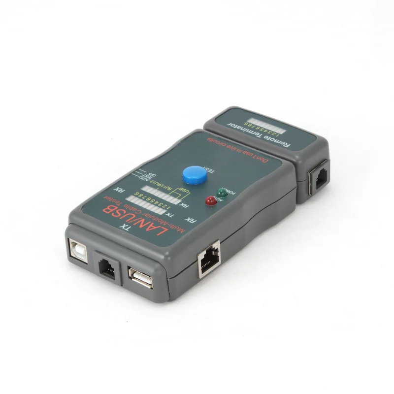
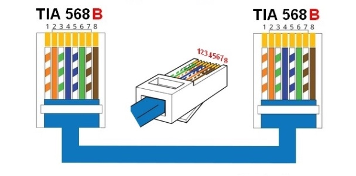
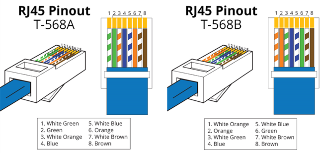

# Montagem e testagem de cabos UTP/STP

*Para realizar a montagem de cabos UTP/STP (Unshielded Twisted Pair/Shielded Twisted Pair), são necessárias algumas ferramentas específicas. Aqui estão as ferramentas essenciais:*

- **Cabo UTP/STP:** O cabo em si, que consiste em pares de fios trançados.

- **Crimpeadora:** Uma ferramenta utilizada para fixar os conectores nos extremos dos cabos. A crimpeadora pressiona os contatos elétricos do conector para dentro dos fios, garantindo uma conexão segura.

- **Conectores RJ45:** Os conectores que são fixados nas extremidades dos cabos para conectar dispositivos de rede, como computadores, switches, e roteadores.

- **Alicate de corte:** Utilizado para cortar o excesso dos fios após a crimpagem e garantir que o conector esteja bem fixado.

- **Alicate de decapagem:** Serve para retirar a camada externa do cabo e expor os fios internos, facilitando a conexão dos fios aos conectores.

- **Testador de cabos:** Embora seja opcional, é altamente recomendável ter um testador de cabos para verificar a integridade e a correta conexão dos cabos após a montagem. Isso ajudará a identificar quaisquer problemas de conexão antes de implementar o cabeamento em sua rede.

*Com estas ferramentas, estará equipado para montar cabos UTP ou STP e configurar a sua rede conforme necessário. Lembre-se de seguir cuidadosamente os passos de montagem para garantir uma conexão sólida e confiável.*
---

# Como montar?

*Preparação do cabo:*

- Corte o cabo ao comprimento desejado.
Use a tesoura ou o descarnador de cabos para retirar cerca de 3 a 5 centímetros do revestimento exterior do cabo, expondo os pares de fios internos.

*Organização dos pares de fios:*

- Separe os pares de fios conforme o padrão de pinagem que você vai seguir (geralmente, é usado o padrão TIA/EIA-568B).

- O esquema típico de organização dos fios é: branco/laranja, laranja, branco/verde, azul, branco/azul, verde, branco/marrom, marrom.

*Corte e alinhamento:*

- Corte as extremidades dos fios para garantir que estejam retas e niveladas.
- Alinhe os fios na ordem correta.

*Inserção nos conectores RJ45:*

- Insira os fios no conector RJ45 na ordem correta, garantindo que cada fio entre na posição designada dentro do conector.
- Certifique-se de que os fios alcancem o final do conector.

*Crimpagem:*

- Use a ferramenta de cravar para pressionar firmemente o conector RJ45 sobre os fios. Aplique pressão suficiente para garantir uma conexão segura, mas evite aplicar força excessiva que possa danificar os fios.

*Inspeção:*

- Verifique visualmente se todos os fios estão totalmente inseridos no conector RJ45 e se não há fios cruzados ou mal conectados.
Teste:

Recomendável, use um testador de cabos para verificar a continuidade e a correta pinagem do cabo. Isso ajudará a identificar e corrigir quaisquer problemas de conexão antes de instalar o cabo na rede.

---
# Qual seria a ordem certa dos cabos? 

***Como está a ver, na primeira extremidade (T568A) que seria a A, a ordem é:***

1. Branco/Verde
2. Verde
3. Branco/Laranja
4. Azul
5. Braco/Azul
6. Laranja
7. Branco/Castanho
8. Castanho

***Na segunda extremidade (T568B) que seria a A, a ordem é:***

1. Branco/Laranja
2. Laranja
3. Branco/Verde
4. Azul
5. Branco/Azul
6. Verde
7. Branco/Castanho
8. Castanho

---

# Quais são as diferenças na ordem, entre um cabo a direito e um cabo cruzado?

**Cabo direto (Straight-through)**

*Um cabo direto (também designado de normal ou straight-through) faz uso dos pares 2 e 3. Para produzir cabos straight-through (cabo que usa o mesmo esquema de pinos em ambos os lados) podemos usar nas extremidades a norma TIA/EIA T568A ou a norma TIA/EIA T568B (usualmente esta). Um cabo direto é usado para ligar equipamentos, como por exemplo, PC, servidor, router a um switch, hub ou bridge.*

**Cabo cruzado (crossover)**

*Um cabo cruzado (também designado de crossover) é usado para ligações de Hub para Hub, Computador para Computador, Switch para Switch, ou seja, entre equipamentos da mesma camada segundo o modelo OSI. Atualmente, todos os equipamentos Gigabit Ethernet e a maior parte dos novos equipamentos já suportam Auto MDI-X (Media Dependent Interface with Crossover – troca automática dos pares de comunicação), não existindo assim necessidade de fazer um cabo cruzado para comunicação entre equipamentos que operam na mesma camada do modelo OSI (ex. PC para PC).*

*Os cabos cruzados são finalizados com uma das pontas com o esquema T568A e a outra ponta com esquema T568B (ou seja, são trocados os cabos 1 com o 3 e o 2 com o 6 de uma ficha para a outra), em que cada um deles terá dois pares para transmissão (TX) e dois pares para receção (RX).*

---

# Qual é o processo de teste de cabos de rede, detalhando a função do testador de cabos RJ45?

**Verificação de Continuidade:**

- O testador de cabos RJ45 envia um sinal elétrico através de cada fio do cabo e verifica se esse sinal é recebido corretamente na extremidade oposta.
- Se houver continuidade elétrica, isso significa que os fios estão conectados corretamente e não há interrupções no cabo.
- Se não houver continuidade em algum dos fios, o testador indicará um problema de conexão.

**Teste de Pinagem:**

- Alguns testadores de cabos também testam a pinagem dos fios para garantir que eles estejam na ordem correta de acordo com o padrão TIA/EIA-568B ou TIA/EIA-568A.
- Isso é importante para garantir que os fios estejam conectados corretamente nos pinos corretos do conector RJ45 em ambas as extremidades do cabo.

**Identificação de Cabos Defeituosos:**

- O testador de cabos RJ45 ajuda a identificar e localizar problemas de cabeamento, como fios soltos, desconectados ou mal conectados.
- Isso permite que você corrija rapidamente qualquer problema no cabeamento antes de implantá-lo na rede.

